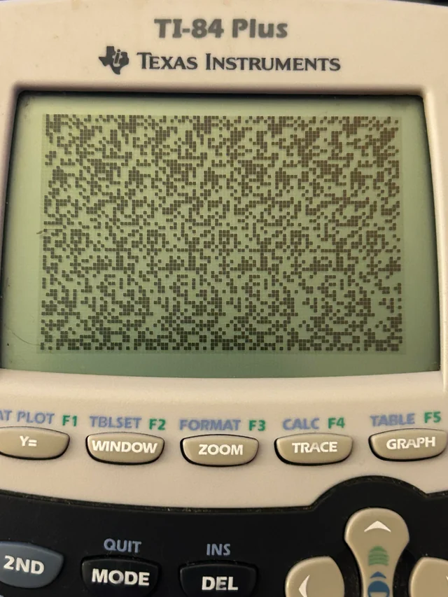

# TI-84 Plus Magic Eye / Stereogram Images

This repo contains a small set of Magic Eye-style stereogram images made for the classic monochrome TI-84 Plus calculator.

The images were generated at a calculator-safe resolution of **94×63 pixels**, which I found displays more reliably than the full nominal TI-84 Plus LCD resolution of 96×64 when using the normal Pic/image transfer workflow.



## Requirements

- TI-84 Plus or compatible monochrome TI-84 calculator
- USB cable that supports data transfer
- TI Connect CE installed on your computer
- The image files from this repo

## Getting the images onto your calculator

1. Connect your TI-84 Plus to your computer with USB.
2. Open **TI Connect CE**.
3. Make sure your calculator appears in TI Connect CE.
4. Send each image to the calculator as a **Pic** variable.

For example:

```text
image1 → Pic1
image2 → Pic2
image3 → Pic3
image4 → Pic4
image5 → Pic5
image6 → Pic6
image7 → Pic7
```

The exact import/send process may vary slightly depending on your version of TI Connect CE, but the goal is to get each image stored on the calculator as `Pic1`, `Pic2`, etc.

## Displaying an image manually

On the calculator, you can display a picture using `RecallPic`.

Key sequence:

```text
2nd → DRAW → STO → RecallPic
VARS → Picture → Pic1
ENTER
```

The command should look like:

```text
RecallPic Pic1
```

Before displaying the image, it can help to turn off graph clutter:

```text
AxesOff
GridOff
ClrDraw
RecallPic Pic1
```

## Notes on resolution

The TI-84 Plus LCD is commonly described as **96×64 pixels**, but in my testing the normal Pic/graphing image workflow did not behave like a perfect raw 96×64 framebuffer for pixel-critical images.

For normal images this may not matter, but for stereograms and 1-pixel patterns, small artifacts can break the illusion.

After testing checkerboards, stripes, and borders, I found that **94×63** displayed cleanly with my workflow, so these images are built around that practical safe resolution.

## Viewing tip

These are tiny monochrome stereograms, so they may take a little patience. Try viewing the calculator screen straight-on, with good lighting, and relax your eyes as you would with a normal Magic Eye image. This one is parallel view (wall-eyed) so you want to divert your eyes, not cross them. 
